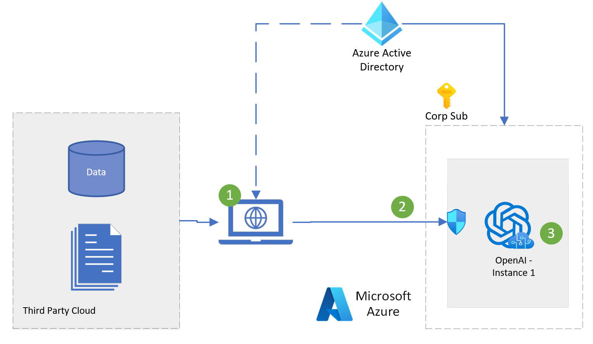

# Azure OpenAI Deployment Scenarios
Repository of deployment scenarios for Azure OpenAI within regulated industries 

## Scenario 1:
Complete cloud isolation between data and Azure OpenAI Service

### Key Solution Advantages:
*	<b> Low barrier to entry</b> - get started using Azure OpenAI models today.
*	<b> Compatible with multi-cloud environments</b> - enable secure user access to Azure OpenAI models (GPT-3.5, Turbo 3.5, GPT-4) from any cloud.
*   <b>Full OpenAI model capabilities</b> - experiment with all Azure OpenAI models ([model list](https://learn.microsoft.com/en-us/azure/cognitive-services/openai/concepts/models)) on your enterprise use-cases

### Reference Architecture

<h5>
<ol>
    <li>Client Application connects to Azure OpenAI service using existing application capabilities. Compatible with direct REST API Access as well as popular app frameworks (Python, Node.js, Java, C#...)</li>
    <li>Access to endpoints performed through token based authentication.  Network traffic secured via Firewall  </li>
    <li>OpenAI deployed models (GPT-3.5, Turbo 3.5, GPT-4) </li>
</ol>
</h5>

### Getting Started

#### Prerequisites
- [Azure Subscription](https://azure.microsoft.com/en-us/get-started/)
- [Azure OpenAI Application](https://aka.ms/oai/access) 

#### Installation
- Provisioning steps:
- TODO: [Deploy to Azure Button]